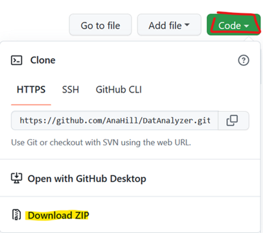

# DatAnalyzer
Tools to load, visualize, and analyse data using MATLAB.  
_Please notice, that this readme is currently under developement!_

The main philosophy of this program is to provide flexible, customizable semi-autonomous data analysis tools. Idea is, that all functionalities can be used either through GUI (DatAnalyzer App) or through MATLAB's command line (or scripts). The meaning of semi-autonomous here is that DatAnalyzer provides _i_) quite good automatic settings, for example to detect most of the peaks from large data-sets, and _ii_) flexible tools to manually modify these found peaks, for example deleting some incorrect ones or add individual missing peaks.

**Please notice that currenly, DatAnalyzer works best with MEA .h5 files**  
Before MEA data  can be viewed or analyzed, measurement files must be converted to HDF5 files. Multichannel Systems data, this can be done using their MultiChannel Systems Data Manager software (available [here](https://www.multichannelsystems.com/software/multi-channel-datamanager#docs))


## Installation
Prerequisites for DatAnalyzer
- MATLAB R2018B or newer


Installing files either cloning
```
git clone https://github.com/AnaHill/DatAnalyzer.git
```
Or choose Code --> Download ZIP --> unzip files to your computer. Snapshot below highlights these steps.



## References and Citation
DatAnalyzer was partly developed during the research related to following paper. If you find DatAnalyzer useful, please consider citing 
> Häkli, M., Kreutzer, J., Mäki, A.-J., Välimäki, H., Lappi, H., Huhtala, H., Kallio, P., Aalto-Setälä, K., & Pekkanen-Mattila, M. (2021). Human induced pluripotent stem cell-based platform for modeling cardiac ischemia. Scientific Reports, 11(1), 4153. https://doi.org/10.1038/s41598-021-83740-w

## Code structure
- TBA


## Example Data and tutorial for DatAnalyzer

Example data, that is used in the following tutorial is available [here](https://google.com).TODO #3:link

## Future improvements
TO DO list
- [ ] Provide link to example data and write tutorial
- [ ] Good data recommender: check raw (MEA) data and recommend which electrodes would include information (measurement data) as typically many electrodes mainly include noise
- [ ] cropping data: user could crop data by mouse, e.g. covering only time between 10 and 15 sec in 1 minute long recording
- [ ] abf file reading for MEA files
