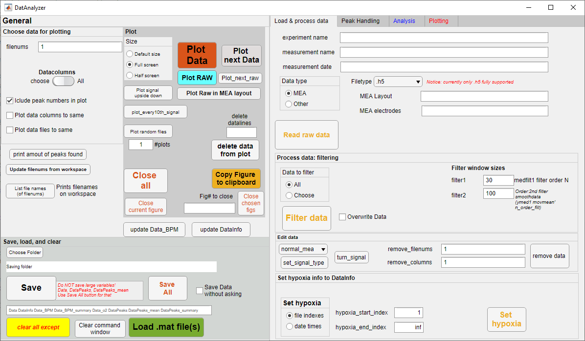
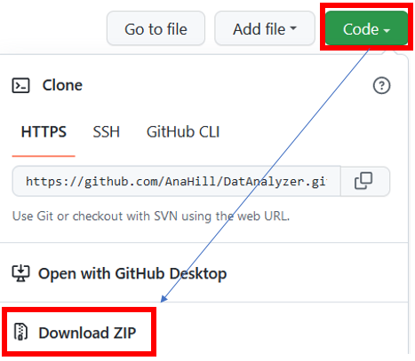
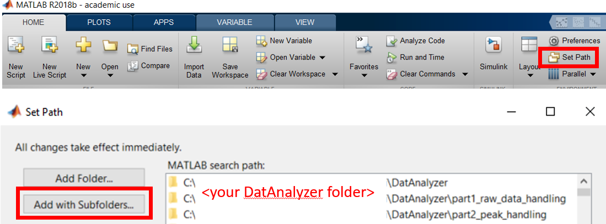
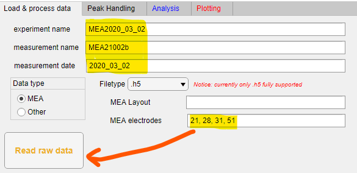
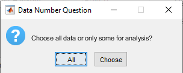

# DatAnalyzer
Tools to load, visualize, and analyse data using MATLAB.  
_Please notice, that this readme is currently under developement!_

The main philosophy of this program is to provide flexible, customizable semi-autonomous data analysis tools. Idea is, that all functionalities can be used either through GUI (DatAnalyzer App) or through MATLAB's command line (or scripts). The meaning of semi-autonomous here is that DatAnalyzer provides _i_) quite good automatic settings, for example to detect most of the peaks from large data-sets, and _ii_) flexible tools to manually modify these found peaks, for example deleting some incorrect ones or add individual missing peaks.

**Notice: currently, DatAnalyzer works best with MEA .h5 files**  
Before MEA data can be viewed or analyzed, measurement files must be converted to HDF5 (.h5) files. 
If using Multichannel Systems devices, this data conversion to .h5 files can be done using their MultiChannel Systems Data Manager software, available [here](https://www.multichannelsystems.com/software/multi-channel-datamanager#docs).

Snapshot below shows the opening page of the developed GUI



## Installation
Prerequisites for DatAnalyzer
- MATLAB R2018B or newer


Installing files either cloning
```
git clone https://github.com/AnaHill/DatAnalyzer.git
```
Or choose Code --> Download ZIP --> unzip files to some folder in your computer. Snapshot below highlights these steps.  


Add your folder (_with subfolder_!) to MATLAB's path (see snapshot below): Home tab --> Set Path --> Add with Subfolders  


## References and Citations
DatAnalyzer has been developed at Tampere University (TAU) in [Micro- and Nanosystems Research Group](https://research.tuni.fi/mst/) (MST) lead by professor Pasi Kallio. 
It has partly developed during the collaboration project between MST and TAU's [Heart Group](https://research.tuni.fi/heart-group/) lead by professor Katriina Aalto-Setälä. 
If you find DatAnalyzer useful, please consider citing following paper
> Häkli, M., Kreutzer, J., Mäki, A.-J., Välimäki, H., Lappi, H., Huhtala, H., Kallio, P., Aalto-Setälä, K., & Pekkanen-Mattila, M. (2021). Human induced pluripotent stem cell-based platform for modeling cardiac ischemia. Scientific Reports, 11(1), 4153. https://doi.org/10.1038/s41598-021-83740-w

## Code structure
- TBA


## Example Data and tutorial for DatAnalyzer
_Notice: Example data used in the tutorial will be available later._ 
<!-- in[TBA](https://google.com)._ TODO #3:link --> 

This section introduces briefly DatAnalyzer. Basic steps are following
1) loading raw data
2) data exploration (plotting)
3) finding peaks
4) analyze

In the following example, MEA raw data (.h5 files) is loaded and analyzed. 

### Load raw data
Go to _Load & process data_ tab to load data, where you can fill the following fields. Notice, that this is only recommendation, not compulsory, as these parameters will be asked again later during the loading process. The figure below shows which sections were filled 
- `experiment name`: MEA2020_03_02 (experimental name that can include several parallel measurements, seperated with the next field)
- `measurement name`: MEA21002b (used to separate parallel experiments belonging to same experiment)
- `measurement date`: 2020_03_02 (starting day of the experiment) 

In addition, so-called "good MEA electrodes" were chosen beforehand to reduce the amount of data loaded. In this example, MEA electrodes 21, 28, 31, and 51 had a reasonable beating and were chosen for further analysis.
(_Notice: currently, choose of the "good" electrodes is a manual process, which can be done in MATLAB or any other software. So-called "good data recommender" have been developed separately but it had not yet been implemented in DatAnalyzer._)

After these fields are filled, click _Read raw data_ button.


For the start, choose folder where your data is located. During loading process, DatAnalyzer will ask several questions. Firstly, it asks that are all found data (files) or only some used. This can be used to pick only certain data files from the chosen folder. If you click _Choose_, you can pick which files are loaded as shown in the following figures




Next, 


## Future improvements
**Currently under development**
- [ ] Provide link to example data and write tutorial
- [ ] Good data recommender: checks raw (MEA) data and recommends "most suitable" electrodes 
  - Recommended data/electrodes should include measurement information (e.g. beating signal) as typically many electrodes mainly include noise
- [ ] .abf file reading for MEA files
- [ ] GUI: fusing Analysis and plotting tabs to single tab
- [ ] Area under curve calculation for FP signal

**Backlog / Long-term goals**
- [ ] Calculate and visualize signal propagation (for MEA files)
- [ ] More interactive GUI, e.g. user could
  - [ ] delete or add peaks by clicking mouse
  - [ ] crop data by mouse for partial data analysis, e.g. only consider time between 10 and 15 sec in 1 minute long recording
- [ ] More options for data filtering 
- [ ] Architechtural change enabling better data analysis
