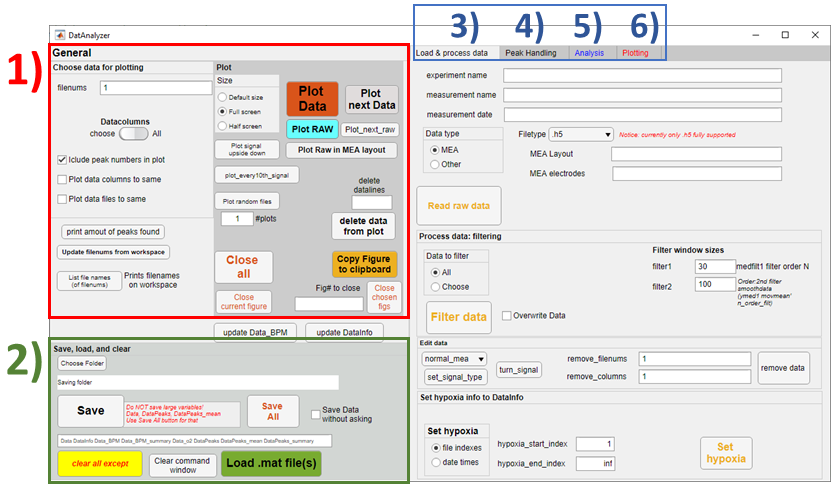

# DatAnalyzer
Tools to load, visualize, and analyse data using MATLAB.  
_Please notice, that this readme is currently under development!_

The main philosophy of this program is to provide flexible, customizable semi-autonomous data analysis tools. Idea is, that all functionalities can be used either through GUI (DatAnalyzer App) or through MATLAB's command line (or scripts). The meaning of semi-autonomous here is that DatAnalyzer provides _i_) quite good automatic settings, for example to detect most of the peaks from large data-sets, and _ii_) flexible tools to manually modify these found peaks, for example deleting some incorrect ones or add individual missing peaks.

**Notice: currently, DatAnalyzer works best with MEA .h5 files**  
Before MEA data can be viewed or analyzed, measurement files must be converted to HDF5 (.h5) files. 
If using Multichannel Systems devices, this data conversion to .h5 files can be done using their MultiChannel Systems Data Manager software, available [here](https://www.multichannelsystems.com/software/multi-channel-datamanager#docs).

Snapshot below shows the opening page of the developed GUI.
  
**Figure 1.** Main page of DatAnalyzer GUI. Highlighted parts are following: 1) plotting raw data and found peaks, 2) saving and loading, 3) load and process raw data, 4) findling and handling peaks, 5) analysis, 6) plotting final results.


## Installation
Prerequisites for DatAnalyzer
- MATLAB R2018B or newer


Installing files either cloning
```
git clone https://github.com/AnaHill/DatAnalyzer.git
```
Or choose Code --> Download ZIP --> unzip files to some folder in your computer. Snapshot below highlights these steps.  
  
**Figure 2.** Downloading codes.

Add your folder (_with subfolder_!) to MATLAB's path (see snapshot below): Home tab --> Set Path --> Add with Subfolders  
  
**Figure 3.** Setting DatAnalyzer folder for MATLAB path.

## References and Citations
DatAnalyzer has been developed at Tampere University (TAU) in [Micro- and Nanosystems Research Group](https://research.tuni.fi/mst/) (MST) lead by professor Pasi Kallio. 
It has partly developed during the collaboration project between MST and TAU's [Heart Group](https://research.tuni.fi/heart-group/) lead by professor Katriina Aalto-Setälä. 

If you find DatAnalyzer useful, please consider citing following papers
> - Häkli, M., Kreutzer, J., Mäki, A.-J., Välimäki, H., Lappi, H., Huhtala, H., Kallio, P., Aalto-Setälä, K., & Pekkanen-Mattila, M. (2021). Human induced pluripotent stem cell-based platform for modeling cardiac ischemia. _Scientific Reports_, 11(1), 4153. https://doi.org/10.1038/s41598-021-83740-w
> - Häkli, M _et al_. (2022). Electrophysiological changes of human induced pluripotent stem cell-derived cardiomyocytes during acute hypoxia and reoxygenation. _Stem Cells International_ (Accepted).

## Code structure
- TBA


## Example Data and tutorial for DatAnalyzer
_Notice: Example data used in the tutorial will be available later._ 
<!-- in[TBA](https://google.com)._ TODO #3:link --> 

This section introduces briefly DatAnalyzer. Basic steps are following
1) loading raw data
2) data exploration (plotting)
3) finding peaks
4) analyze

In the following example, MEA raw data (.h5 files) is loaded and analyzed. This dataset includes 129 .h5 files from 60 MEA electrodes measurement. In the example, only four previously chosen electrodes are used for the analysis.

### Load raw data
Go to _Load & process data_ tab to load data, where you can fill the following fields. Notice, that this is only recommendation, not compulsory, as these parameters will be asked again later during the loading process. The figure below shows which sections were filled 
- `experiment name`: MEA2020_03_02 (experimental name that can include several parallel measurements that arre separated with the next field)
- `measurement name`: MEA21002b (used to separate parallel experiments belonging to same experiment)
- `measurement date`: 2020_03_02 (starting day of the experiment) 

In addition, so-called "good MEA electrodes" were chosen beforehand to reduce the amount of data loaded. In this example, MEA electrodes 21, 28, 31, and 51 had a reasonable beating and were chosen for further analysis. _MEA Layout_ field, showed in Tutorial Figure 1, is now empty as a default electrode layout, Multichannels 60-MEA, is used. In case of other layout, you should load text file that has similar structure than file `mea_layouts\MEA_64_electrode_layout.txt`: first column indicates electode number, second _index_ points colummn in the raw data. Please also notice that currently, choose of the "good" electrodes is a manual process, which can be done in MATLAB or any other software beforehand. So-called automatical "good data recommender" have been developed separately but it had not yet been implemented in DatAnalyzer.

After the fields are filled, click _Read raw data_ button as shown in Tutorial Figure 1. For the start, choose folder where your data is located. During loading process, DatAnalyzer will ask several questions. Firstly, it asks that are all found data (files) or only some used. This can be used to pick only certain data files from the chosen folder. If you click _Choose_, you can pick which files are loaded as shown in the following figure (4b). Then, loading of raw data files is started, and finally, there should be two variables, Data and DataInfo, on the Workspace.


**Tutorial Figure 1.** Process of loading raw data: 1) setting initial parameters and clicking  _Read raw data_ button, 2) choosing raw data folder, 3) a screenshot of the command window listing files found on the folder, 4) using all the found files or choosing some of those; if latter chosen, window like presented in 4b) is provided to choose specific file(s), 5) a screenshot of reading process displayed on Command Window, and 6) finally, two variables (Data and DataInfo) are created on the Workscape.

During process, if will be asked "_Want to plot every 10th data?_". If chosen yes, it will be plot every 10th for fast checking. With this, first and last data are always plotted (as presented below in Tutorial Figure 2), resulting that in the example (with 129 files), totally 14 separate 2x2 subplot figures are plotted. 


**Tutorial Figure 2.** Demonstration what data will be plotted if answere Yes to Plot fig question.

## Data exploration and plotting
Before finding peaks for further analysis, it is typically useful to manually check loaded data. The main parts are presented in Tutorial Figure 3.


**Tutorial Figure 3.** Plotting tools for data exploration: 1) choosing file numbers and data columns (electodes); if field `Datacolumns` is set to _All_, all columns will be plotted, but this can be changed by clicking _choose_, and writing wanted data column number(s) to appeared _columns_ field as shown in the inspect; 2) choosing, how chosen data are plotted, e.g. in separate or same figure. Examples will be given below; 3) choosing plot parameters (figure size and are found peaks included) and plotting data.

Next, some examples of how data can be plotted are given using options presented in part 2) in Tutorial Figure 3. Figures are using files numbered 1, 50, and 129 (last one), and all data columns, which is four different electrodes in this example. Notice, that in the following figures, the figure size is set to MATLAB's default size as highlighted in Tutorial Figure 4.


**Tutorial Figure 4.** Example raw plot#1: when neither data columns or data files to same are not checked, three separate 2x2 subplots are plotted.


**Tutorial Figure 5.** Example raw plot#2: when data columns to same are checked, three separate figures without subplots are plotted; each plot includes all four electode data separated by colors.


**Tutorial Figure 6.** Example raw plot#3: when both data columns and files to same are checked, only one figure including all 12 signals (3 files * 4 electrodes) is plotted.

With the tools presented above, you can estimate what would be good rules to find the peaks. This will be explained in next section.

### Find peaks
This part involves includes the most of the required manual work in the whole analysis process. I strongly believe, that it is very difficult, if not even impossible, to totally automatize this step so that it would handle all the possible field potential signals. This is because signal amplitudes, frequencies, signal-to-noise ratios, and signal forms varies greatly between different measurements, electrodes, used hardware set-up. (e.g. used amplifier), and so on. More correctly each individual peak is defined will improve the following analysis. Therefore, DatAnalyzer is designed to take the following semi-autonomous approach so that the user can easily:
1) find peaks in batch mode from all the files and datacolumns (i.e. electrodes), or only find peaks for specific data files and/or data colummns addressed by the user
2) find/add invidual missing peaks on specific locations (file, datacolumn, time range)
3) remove specific, typically incorrect, peaks

To demonstrate above statements, we will first find low peaks from each data file. Looking raw data that was presented in the previous section, we estimated that minimum peak amplitude could be set to 5e-5 (V, i.e. 50 µV), and max beating frequency Max BPM to 40 beats-per-minute as shown in Tutorial Figure 7. With these parameters, we will find quite many correct peaks, however, some manual tuning is needed as will be presented next in this section.


**Tutorial Figure 7.** Finding peaks: intial run to batch all signals. Properties are set in 1), where filenums, data columns, and peak rules are set. Peak finding is started with find_peaks_with_rules button. After processed, Data_BPM variable should be created on MATLAB Workspace as shown in 2). Next, in 3) six different files (file numbers 1, 31, 61, 91, 121, and 129) are plotted. 
<!-- These figures are discussed in more detail in the following figures.  -->


**Tutorial Figure 8.** .


### Analyze peaks


## Future improvements
**Currently under development**
- [ ] Provide link to example data and write tutorial
- [ ] Good data recommender: checks raw (MEA) data and recommends "most suitable" electrodes 
  - Recommended data/electrodes should include measurement information (e.g. beating signal) as typically many electrodes mainly include noise
- [ ] .abf file reading for MEA files
- [ ] GUI: fusing Analysis and plotting tabs to single tab
- [ ] Area under curve calculation for FP signal

**Backlog / Long-term goals**
- [ ] Calculate and visualize signal propagation (for MEA files)
- [ ] More interactive GUI, e.g. user could
  - [ ] delete or add peaks by clicking mouse
  - [ ] crop data by mouse for partial data analysis, e.g. only consider time between 10 and 15 sec in a minute-long recording
- [ ] More data filtering options
- [ ] Architectural change enabling better data analysis
